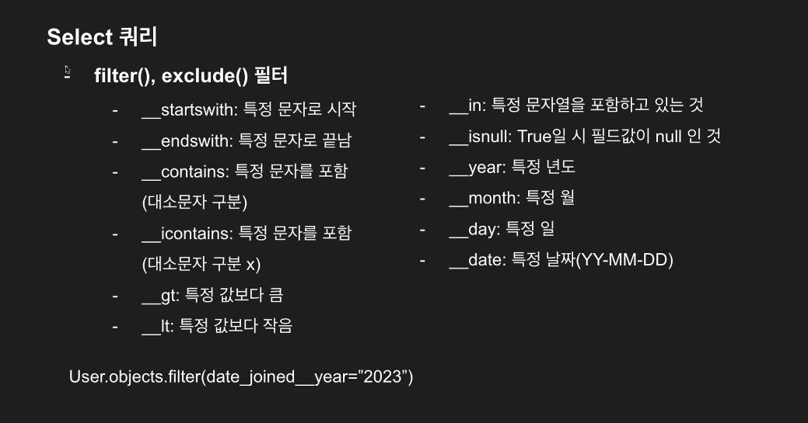

add_error:
add_error는 폼 자체에서 발생한 에러 이외에 다른 오류를 구분지어 추가해주기 위해 사용하는 메서드입니다. form.add_error(‘filed_name’, ‘error 내용’) 이렇게 폼에 해당하는 필드에 오류 내용을 새롭게 정의해서 추가할 수 있습니다.

LoginRequiredMixin:
LoginRequiredMixin은 사용자가 로그인을 해야 접근 가능한 클래스를 만들어주는 mixin입니다. 여기서 login_url은 로그인하지 않은 유저가 해당 클래스에 접근했을 경우, 보내주는 경로를 나타내주는데 일반적으로 login 경로로 보내주게 됩니다.
    만약 다음 경로를 다른 경로로 지정해주고 싶을 때는 해당 클래스로 접근하는 동작이 일어나는 화면 속 GET 요청의 render 부분에서<input type="hidden" name="next" value="{{ request.get_full_path }}"> 이런식으로 input에서 next 같은 이름으로 보내줄 경로를 입력해주면 다음 POST 요청에서 해당 값을 이용해서(next_url 키워드) 원하는 경로로 보내줄 수 있습니다.

Django Template Engine의 변수 필터 활용:
템플릿에서 변수 필터를 사용하려면 {{ value|filter:parameter }} 이와 같은 양식으로 사용합니다.
단순히 필터를 적용할 때는 {{ value|filter }} 이렇게 사용하고 여러 필터를 함께 사용(체인 필터)하려면 {{ value|filter1|filter2 }} 이와 같이 사용합니다. 또 템플릿 태그와 함께 사용할 경우에는 {{ template_tag|filter:parameter }} 이와 같이 사용할 수 있습니다.
필터에 매개변수를 전달하려면 {{ value|filter:”parameter” }} 이렇게 사용해야 합니다.
내장 필터 종류에는 upper, lower, length, default, join, slice 등이 있습니다.

### Select 쿼리
all
get => get_or_404 예외처리
filter
exclude
count
exist

values : 딕셔너리
values_list : 튜플
order_by : 정렬. 인자에 - 주면 내림차순이 됨
first, last : 처음과 마지막
aggregate : group by ex) aggregate(Avg('age'))
annotate : as ex) annotate(title=F("post__comment")).values('title')

### F
F(): 파이썬 메모리 효율을 위해서 사용하는 구문.
F("post__comment") : post에 연결된 comment에 접근할 때 __ 이렇게 접근이 가능한데. 이렇게 가져올 때 파이썬의 메모리를 가져오는게아니라 데이터베이스에서 처리해서 가져오도록 함.

다중필터
- 논리연산자  
    - filter() & filter()
    - filter() | filter()
    - !filter() 
- Q() 조건문
    from django.db.models import Q
    filter(Q(조건1) & Q(조건2))

### Insert 쿼리

Class.objects.create()
Class.objects.bulk_create([Post(인자들), ....])
Class.objects.get_or_create()
=> comment, created = Comment.objects.get_or_create(~~~) 로 쓰면 값이 있을때는 comment에 담기고 값이 없을때는 created에 표시를 해줌.
=> 이걸 못쓸때는 try~ except Exception as e : print("Error occurred", str(e)) 식으로 처리함
필드값이 비어있을 때 : ValidationError
외래키관련 데이터베이스 오류 : ObjectDoesNotExist

### Update

- 직접접근  
post = Post.objects.get
post.title = ~~ 
post.save() 식으로 update

- Post.objects.get.update(필드명=바꿀값)

### Delete

post = Post.objects.get
post.delete()

### 쿼리 고도화(JOIN)

- select_related  
데이터베이스에서 JOIN을 한 다음에 가지고 옴

- prefetch_related  
JOIN할 대상을 가지고 온 이후에 파이썬 상에서 JOIN 함.
